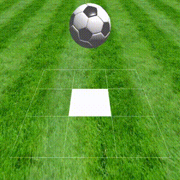

# Football juggling game

## Demo



## Downloading data

Download the data for the game and place it in the `data` directory.
You should do this to avoid licensing issues.

### 1. Football.obj, Football.mtl

<https://free3d.com/3d-model/simple-soccer-ball-53105.html>

### 2. grass.jpg

Download "芝生02" (JPG（Zip圧縮）) and rename it `grass.jpg`

<https://kenchiku-pers.com/download/63.html>

## Building

### Dependencies

- glfw
- glm

### Ubuntu

```bash
mkdir build && cd build
cmake .. -DCMAKE_BUILD_TYPE=Release
make
./football-juggling
```

### Windows (Visual Studio)

Please build by yourself using the libraries in the `external` directory.

## Reference

<https://github.com/tatsy/OpenGLCourseJP>
